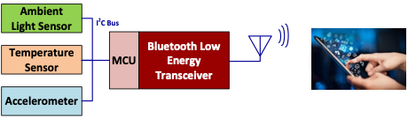

# Compact BLE IoT Sensor Node
This IoT reference design is a compact BLE sensor node that features:
- Bluetooth Low Energy (BLE) wireless connectivity
- Array of real-time sensors
- Direct smartphone/tablet connectivity
- Coin cell battery for long life operation
- Small form factor
- JTAG programming access

The BLE SoC integrates an ARM Cortex-M3 to
control the wireless transceiver and interface with
the sensors. This design combines an ambient light
sensor, a temperature sensor, and an accelerometer
to enable applications such as building automation,
industrial equipment monitoring, etc.

A software interface app to display and log data is
included, and can be readily installed on any
Android system with BLE capabilities. This app
can communicate with and configure any sensor
node within the communications radius. The app
also provides estimates of the signal strength and
remaining battery lifetime for each sensor node.

This compact BLE sensor node can be used in
applications including:

- Real time sensing of ambient light and temperature for environmental monitoring and control
- HVAC systems and building automation
- Shock, vibration, and temperature monitoring of industrial equipment
- Theft, temperature monitoring of storage/shipping containers

This IoT Platform consists of:
- PCB design files for the KiCad v5.1.9 design environment.
- Source code and binary format firmware
- Android mobile app for data logging via smart phone

This project is provided as-is. Working samples (Alpha version) were created and tested successfully.

Prevents versions can be retreived by selecting the appropriate tag on Github at github.com/cmcmicrosystems/iot_platform

Versions:

Beta_HW_SW_Supported: Supported Hardware and Software for battery operation.  Manufactured 45 prototypes. aka SwiftMote IoT2021A

Beta : Current KiCAD v5.1.9. In manufacturing.  Changes made to sensors and crystals in BoM due to covid chip shortages.  New firmware for TMP100 temperature sensor (replacement for SI7051 in alpha).  Manufacturing information included.

Alpha : Initial version in Mentor Graphics PADS.  tested on a PCB, functional.
